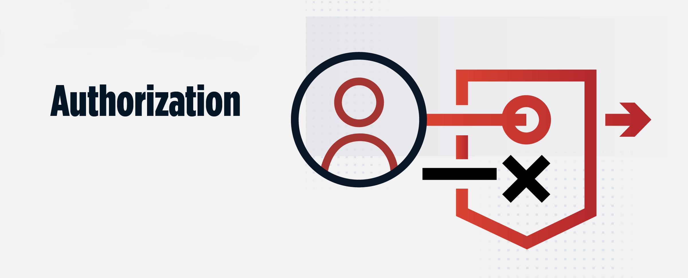

# Sistema de Autenticación y Autorización con NestJS



## Descripción del Proyecto

Este proyecto implementa un sistema de autenticación y autorización basado en NestJS, permitiendo a los usuarios registrarse, iniciar sesión y gestionar sus sesiones de manera segura mediante tokens JWT. La implementación está completamente en español, facilitando su comprensión y uso para desarrolladores hispanohablantes.

### Características Principales

- **Registro de Usuarios:** Permite la creación de nuevos usuarios con validaciones exhaustivas para garantizar la integridad de los datos.
  
- **Inicio de Sesión:** Autentica a los usuarios mediante email y contraseña, generando tokens JWT de acceso y refresh para sesiones autenticadas.

- **Manejo de Tokens:** Genera y administra tokens de refresh con fechas de expiración configurables, asegurando la seguridad de las sesiones.

- **Validación de Usuarios:** Verifica las credenciales de los usuarios y gestiona contraseñas de forma segura.

- **Manejo de Errores:** Utiliza un conjunto de códigos y mensajes de error predefinidos para diferentes situaciones, todos en español.

### Tecnologías Utilizadas

- **NestJS:** Framework para construir APIs robustas y escalables.
- **TypeORM:** ORM para interactuar con la base de datos.
- **JWT (Json Web Tokens):** Para la gestión de autenticación y sesiones.
- **UUID:** Para la generación de tokens de refresh únicos.

### Estructura del Proyecto

- **AuthService:** Lógica de autenticación, generación de tokens y validación de usuarios.
- **UserService:** Gestión de usuarios en la base de datos.
- **DTOs (Data Transfer Objects):** Estructuras de datos para solicitudes y respuestas.
- **Entities:** Definiciones de entidades de la base de datos, como usuarios y tokens de refresh.
- **Manejo de Errores:** Implementación detallada del manejo de errores con mensajes en español.

### Flujo de Trabajo

1. **Registro de Usuario:** Validación y creación de nuevos usuarios.
2. **Inicio de Sesión:** Autenticación y generación de tokens de acceso y refresh.
3. **Manejo de Tokens:** Tokens con duración limitada y almacenamiento seguro en la base de datos.

### En Español ^_^

Toda la implementación está diseñada y documentada en español, sin barreras idiomáticas para los desarrolladores hispanohablantes.

## Instalación

Para instalar las dependencias del proyecto, ejecuta:

```bash
yarn
```

## Uso

Para iniciar el servidor en modo de desarrollo:

```bash
yarn dev
```

Para construir el proyecto y ejecutarlo en modo de producción:

```bash
yarn build
yarn start:prod
```

## Pruebas

Para ejecutar las pruebas:

```bash
yarn test
```

Para ejecutar las pruebas en modo de observación:

```bash
yarn test:watch
```

## Documentación API

La documentación de la API se genera automáticamente con Swagger. Puedes acceder a ella en la ruta /api de tu servidor local una vez que esté en ejecución.

## Licencia

Este proyecto está bajo la licencia MIT.
